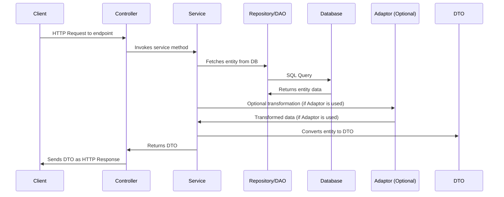

# Mini Project

The project references "Master Java Web Services and REST API with Spring Boot" from O'Reilly. The project is divided into small steps. Below you can find the steps and the description of each step. Each step is saved as a git branch; switch branch to see the progress of each step.

## Step 1

**project scope**

Outline and describe the project, including the two database tables, their interaction, and the exposed endpoints.

## Step 2

**Initalise project**

- create github reposotory branches on Github for each step
  
- Create a project using Spring Boot Initaliser website give the project a name and add project dependencies.
  
- outline layers (repositories, entities, services, controllers, DTOs, and adapters)
  
- Ensure the project builds.
  
## Step 3

Create logic for Layers: dto, entity

- use H2 database
  
## Step 4

**Service, swagger**

Create logic for Layers: Service, swagger

## Step 5

**repository, dao, adaptor**

Create logic for Layers: dao, adaptor

- use jdbc for the dao
  
## Step 6

**repository**

Create logic for Layers: repository

- use replace jdbc dao's with jpa repositories
  
## Step 7

**Spring Data REST**

[Spring Data – One API To Rule Them All?](https://www.infoq.com/articles/spring-data-intro/)

<https://spring.io/projects/spring-data-rest>

## Step 8

**MySQL**

change from h2 database to SQL

## Step 9

**docker**

- dockerise the project
  

 

# Layer explanation:
Sure! Let's break this down layer by layer.

1. **Entity**: This is essentially your data model. It usually maps directly to a table in the database. It represents the data structure that you'll be dealing with in your application.
  
2. **Repository (or DAO - Data Access Object)**: This layer interacts with the database. If using Spring Data JPA, for instance, the Repository interfaces might extend `JpaRepository<EntityType, IDType>`, and Spring would provide the actual implementation for basic CRUD operations. DAOs are more manual and often contain SQL or HQL queries to interact with the database.
  
3. **Adaptor**: While this is not always a conventional layer in all Spring Boot applications, the purpose of the adaptor could be to provide conversions or transformations from one model to another, or to encapsulate external system interactions.
  
4. **DTO (Data Transfer Object)**: It's an object that carries data between processes. In the context of a Spring Boot application, it's commonly used to define the shape of data going out to or coming into the application from the outside world (like a JSON payload). It might not have all the fields an entity has or might structure them differently.
  
5. **Service**: This layer contains your business logic. It fetches the data from the repository, processes it (if required), and then returns it. The processing could involve converting entities to DTOs or vice versa. The service might also interact with adaptors if there's a need to connect with external systems or perform additional transformations.
  
6. **Controller**: This is the web layer that interacts with the client, e.g., a browser or another service. When a request hits an endpoint in your Controller, the Controller calls the relevant Service method to get data. Once the data is fetched and processed, it is typically returned as a DTO.

 

# Sequence Diagram

 

Here's a simplified flow:

1. A request is made to an endpoint in your application.
2. The Controller handling that endpoint receives the request.
3. The Controller calls the appropriate method in the Service layer.
4. The Service layer, depending on the request, might invoke the Repository or DAO to fetch the relevant Entity or Entities from the database.
5. If there are interactions with other systems, or if transformations are required, the Service might make use of Adaptors.
6. Once the Entity is fetched, the Service might convert this Entity into a DTO (if they're different).
7. The Service returns this DTO back to the Controller.
8. The Controller sends the DTO as a response, which might be automatically converted to JSON (thanks to libraries like Jackson if you're using Spring Boot).

A thing to note is that while the above flow assumes the movement of data from the database to the URL endpoint, similar flows can be explained for the reverse: taking data from a URL endpoint and saving it in a database.

This pattern ensures separation of concerns in the application, promotes code reusability, and makes the system easier to maintain.

 

# Resources

Master Java Web Services and REST API with Spring Boot
<https://learning.oreilly.com/videos/master-java-web/>

<https://github.com/packtpublishing/master-java-web-services-and-rest-api-with-spring-boot>
