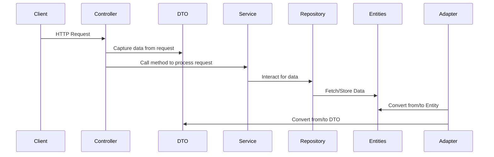

Spring Boot often follows a layered architecture, which helps in organizing the codebase and ensuring separation of concerns. Let's break down the commonly mentioned layers:

1. **Adapter**:
    - **Purpose**: As previously explained, an adapter is used to make one interface compatible with another. This is typically used when integrating with third-party libraries, systems, or legacy code to ensure compatibility without modifying the original code.
    - **Common Use Cases**: Convert third-party library calls into expected application calls, integrate with legacy systems.

2. **Controller**:
    - **Purpose**: Controllers in Spring Boot handle incoming HTTP requests and route them to appropriate services. They form the entry point to the application's core functionality from a web perspective.
    - **Common Use Cases**: Define endpoints for your RESTful APIs, handle input validation, and return HTTP responses.

3. **DTO (Data Transfer Object)**:
    - **Purpose**: DTOs are plain Java objects that carry data between processes or between layers. They're often used to transfer data between the controller and service layers.
    - **Common Use Cases**: Structure the response of an API, gather data from a client's HTTP request.

4. **Entity**:
    - **Purpose**: Entities represent domain objects and are often mapped to database tables when using an ORM (Object-Relational Mapping) tool like JPA (Java Persistence API). They define the shape and behavior of the core business data.
    - **Common Use Cases**: Represent rows in a database table, encapsulate business logic related to the domain.

5. **Service**:
    - **Purpose**: The service layer contains the core business logic of the application. It provides a bridge between the controllers and the repositories and might also communicate with other services or third-party libraries.
    - **Common Use Cases**: Implement application-specific logic, validate and process data, act as a bridge between controllers and repositories.

6. **Repository**:
    - **Purpose**: The repository layer interacts with the data source, whether it's a database, file system, or another external system. In the context of Spring Data JPA, repositories often extend interfaces like `JpaRepository` to provide CRUD (Create, Read, Update, Delete) operations without the need for boilerplate code.
    - **Common Use Cases**: Perform CRUD operations on entities, query the database using methods or custom queries.

A typical flow in a Spring Boot application would be:

1. A client sends an HTTP request.
2. The request is picked up by a **Controller**.
3. The controller may use a **DTO** to capture specific data from the request.
4. The controller then calls a method in the **Service** layer to process the request.
5. The service layer may interact with the **Repository** to access the data source.
6. Data fetched from or sent to the database would be in the form of **Entities**.
7. The **Adapter** pattern is used in this example to convert **Entities** and **DTO**.

