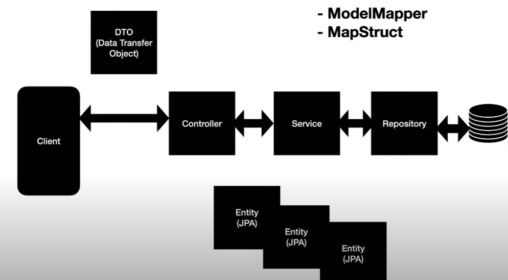

# step 3 – branch dto design all dtos
- data transfer object
    - Just a class
    - ResponseEntity <DTOClass>
    - springboot will automatically serialise the dto to json

# dto design

# resources

# structure
|- src
    |- main
        |- java
            |- com
                |- example
                    |- blockbuster
                        |- controller
                            |- MemberController.java
                            |- VideoController.java
                        |- dto
                            |- MemberDto.java
                            |- VideoDto.java
                        |- model
                            |- Member.java
                            |- Video.java
                        |- service
                            |- MemberService.java
                            |- VideoService.java
        |- resources
            |- application.properties
|- pom.xml
